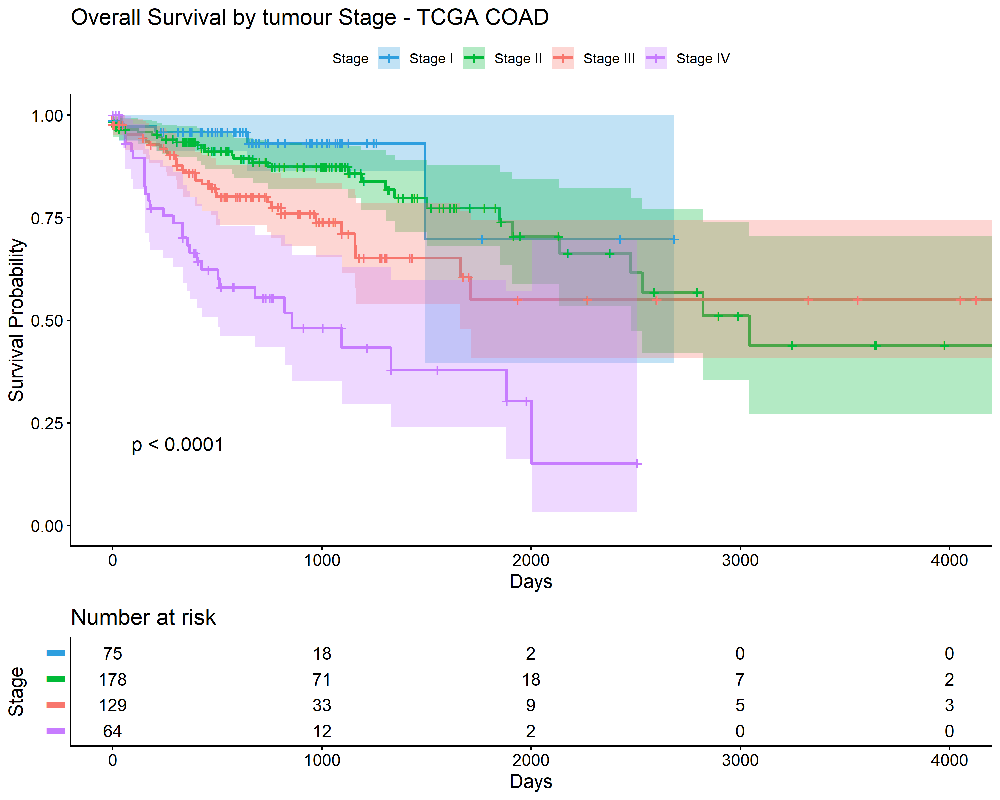

# Clinical Survival Analysis — Colon Adenocarcinoma (TCGA-COAD)

## Background
Tumour stage at diagnosis can be one of the strongest predictors of survival in 
colorectal cancer. This project researches the relationship between clinical cancer
stage and overall survival in colon adenocarcinoma patients using publicly 
available TCGA data.

## Data
- **Source:** TCGA GDC Data Portal (portal.gdc.cancer.gov)
- **Project:** TCGA-COAD (Colon Adenocarcinoma)
- **Patients:** 446 patients with known stage and survival data
- **Variables:** Tumour stage, vital status, survival time, age, gender

## Methods
An initial exploratory analysis was performed using MySQL to investigate stage 
distribution, mortality patterns, and demographic variables. A discrepancy 
in patient counts between SQL and R was identified during deduplication, 
leading to a more rigorous cleaning step in R. Final analysis was performed 
on a deduplicated dataset of 446 patients in R. Survival time was defined as days to death for deceased 
patients and days to last follow-up for censored patients. Kaplan-Meier 
survival curves were compared across stage groups using the log-rank test. 
A Cox proportional hazards model was fitted to assess the independent effect 
of stage, age, and gender on survival.

## Results
Kaplan-Meier analysis showed significantly different survival across stage 
groups (p < 0.0001). Cox regression identified stage and age as independent 
predictors of survival. Compared to Stage I, Stage III and Stage IV patients 
had hazard ratios of 3.76 and 9.74 respectively, indicating substantially 
higher mortality risk. Gender was not a significant predictor of survival 
after controlling for stage and age.

## Visualisation

## Requirements
- R (>= 4.0)
- survival
- survminer
- ggplot2
- dplyr
- readr
- MySQL (exploratory analysis)